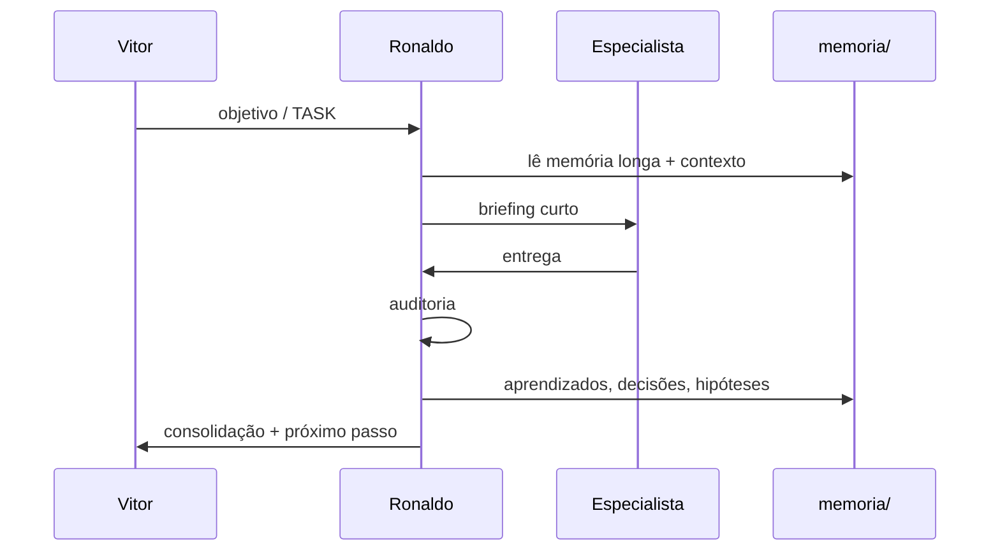

# Arquitetura de agentes e memória multiagente

Documento de referência do Laboratório: como os agentes se organizam, como a memória flui e qual o papel do Ronaldo Maestro.

**Relacionados:** [README](../README.md) · [runtime/ronaldo_runtime.md](../runtime/ronaldo_runtime.md) · [workflows/pipeline_operacional.md](../workflows/pipeline_operacional.md) · [agentes/](../agentes/)

---

## 1. Visão geral

```
                    ┌─────────────────────────┐
                    │   Ronaldo Maestro       │
                    │   memória LONGA           │
                    │   (estratégica)           │
                    └───────────┬─────────────┘
                                │ briefing curto
            ┌───────────────────┼───────────────────┐
            ▼                   ▼                   ▼
     ┌────────────┐      ┌────────────┐      ┌────────────┐
     │  Juarez    │      │    Dev     │      │   Caio     │
     │  memória   │      │  memória   │      │  memória   │
     │  MÉDIA     │      │  por PROJ  │      │  por oferta│
     │ (operacional)     │ (técnica)  │      │ (comercial)│
     └────────────┘      └────────────┘      └────────────┘
            │                   │                   │
            └───────────────────┴───────────────────┘
                                │
                    memória COMPARTILHADA
              decisoes · aprendizados · hipoteses_testadas
                                │
                         auditoria Ronaldo
                         (pós-entrega)
```

---

## 2. Agentes permanentes

| Agente | Papel | Definição | Memória de domínio |
|--------|-------|-----------|-------------------|
| **Ronaldo Maestro** | Orquestrador, consolidador executivo | `agentes/ronaldo_maestro.md` | `memoria/memoria_estrategica_ronaldo.md` |
| **Juarez** | Operação, processos, KPIs | `agentes/juarez.md` | `memoria/memoria_operacional_juarez.md` |
| **Dev** | Software, arquitetura, deploy | `agentes/dev.md` | `memoria/memoria_tecnica_dev.md` |
| **Caio Manteiga** | Comercial, conversão, funis | `agentes/caio_manteiga.md` | `memoria/memoria_comercial_caio.md` |

---

## 3. Camadas de memória

| Camada | Duração | Arquivo(s) | Quem escreve | Quem lê |
|--------|---------|------------|--------------|---------|
| **Longa estratégica** | Meses / trimestre | `memoria_estrategica_ronaldo.md`, `ronaldo_maestro/*` | Ronaldo | Ronaldo (prioritário) |
| **Operacional média** | Semanas / projeto | `memoria_operacional_juarez.md` | Juarez | Juarez, Ronaldo |
| **Técnica por projeto** | Vida do PROJ/TASK | `memoria_tecnica_dev.md` | Dev | Dev, Ronaldo |
| **Comercial por oferta** | Ciclo de campanha | `memoria_comercial_caio.md` | Caio | Caio, Ronaldo |
| **Compartilhada** | Permanente auditável | `decisoes.md`, `aprendizados.md`, `hipoteses_testadas.md` | Todos (Ronaldo audita) | **Todos** |
| **Momento** | Agora | `contexto/contexto_global.md` | Vitor / Ronaldo | **Todos** |
| **Curta (subagente)** | Uma sessão / TASK | Briefing inline | Ronaldo | Subagente temporário |

---

## 4. Ronaldo Maestro — memória longa e coordenação

### Memória longa estratégica

Ronaldo possui **memória longa estratégica** e coordena os demais agentes.

- **Arquivo principal:** `memoria/memoria_estrategica_ronaldo.md`
- **Complemento:** `memoria/ronaldo_maestro/` (histórico de orquestração, mapa, regras de fluxo, decisões críticas)

Conteúdo: prioridades do Vitor, princípios de coordenação, direção de negócio, riscos sistêmicos.

### Briefing curto (obrigatório)

Ronaldo deve **sempre transformar memória longa em briefing curto** antes de delegar execução.

| Entrada (longa) | Saída (curta) |
|-----------------|---------------|
| `memoria_estrategica_ronaldo.md` | 2–4 linhas de objetivo + restrições |
| `contexto_global.md` | Foco da semana |
| `tasks/TASK-XXX.md` | Escopo, critério de pronto, bloqueios |
| Memórias de domínio | Só o trecho relevante à TASK |

**Regra:** especialista recebe briefing enxuto — não dump de memória inteira.

### Auditoria pós-entrega (obrigatório)

Após cada entrega, Ronaldo deve **auditar o resultado** e registrar:

| Tipo | Onde |
|------|------|
| Aprendizado | `memoria/aprendizados.md` |
| Decisão operacional | `memoria/decisoes.md` |
| Decisão estratégica | `memoria/ronaldo_maestro/decisoes_criticas.md` |
| Hipótese testada | `memoria/hipoteses_testadas.md` |
| Ciclo de orquestração | `memoria/ronaldo_maestro/historico_de_orquestracao.md` |
| Evento resumido | `logs/eventos.md` |

Checklist de auditoria:

1. Entrega atende critério de pronto da TASK?
2. Alinhada com critérios de qualidade do pipeline?
3. Houve divergência entre agentes? Decisão registrada?
4. Alguma hipótese mudou de status?
5. Próximo passo claro em 24h?

---

## 5. Juarez — memória operacional média

Juarez possui **memória operacional média**: processos, SLAs, KPIs, gargalos e rotinas por projeto em curso.

- **Arquivo:** `memoria/memoria_operacional_juarez.md`
- **Horizonte:** semanas; arquivar quando projeto encerra
- **Não duplicar:** fatos que todos precisam → `decisoes.md`

---

## 6. Dev — memória técnica por projeto

Dev possui **memória técnica por projeto**: stack, pastas, deploy, ADRs curtos, débito aceito.

- **Arquivo:** `memoria/memoria_tecnica_dev.md` (blocos por `PROJ-XXX` / `TASK-XXX`)
- **Horizonte:** vida útil do projeto
- **Segurança:** nunca registrar secrets — só nomes de env vars

---

## 7. Caio Manteiga — memória comercial por oferta

Caio possui **memória comercial por oferta**: preço, copy, funil, follow-up, objeções, métricas de conversão.

- **Arquivo:** `memoria/memoria_comercial_caio.md` (blocos por oferta / TASK)
- **Horizonte:** ciclo de campanha até resultado medido
- **Hipóteses de preço/funil:** registrar em `hipoteses_testadas.md`

---

## 8. Subagentes temporários — memória curta

Subagentes temporários (helpers pontuais, revisores, pesquisadores one-shot) possuem **memória curta**:

- Recebem **apenas briefing enxuto** produzido pelo Ronaldo
- Sem escrita em memória longa
- Entrega volta ao Ronaldo para auditoria
- Aprendizado relevante sobe para memória compartilhada via Ronaldo

Template de briefing para subagente:

```
Objetivo: (1 frase)
TASK: TASK-XXX
Entregar: (formato)
Restrições: (2–3 bullets)
Não fazer: (1–2 bullets)
Prazo: (se houver)
```

---

## 9. Memória compartilhada (todos)

| Arquivo | Função |
|---------|--------|
| `memoria/decisoes.md` | Decisões visíveis a todo o ecossistema |
| `memoria/aprendizados.md` | O que funcionou / falhou |
| `memoria/hipoteses_testadas.md` | Hipóteses com status e resultado |
| `memoria/agentes.md` | Índice de agentes e quando acionar |
| `memoria/projetos.md` | Portfólio PROJ-XXX |

---

## 10. Fluxo de memória por ciclo



---

## 11. Mapa de arquivos `memoria/`

```
memoria/
├── memoria_estrategica_ronaldo.md   # longa — Ronaldo
├── memoria_operacional_juarez.md    # média — Juarez
├── memoria_tecnica_dev.md           # por projeto — Dev
├── memoria_comercial_caio.md        # por oferta — Caio
├── decisoes.md                      # compartilhada
├── aprendizados.md                  # compartilhada
├── hipoteses_testadas.md            # compartilhada
├── agentes.md
├── projetos.md
└── ronaldo_maestro/                 # fluxo de orquestração (Ronaldo)
    ├── contexto_estrategico.md
    ├── decisoes_criticas.md
    ├── historico_de_orquestracao.md
    ├── mapa_dos_agentes.md
    └── regras_do_ecossistema.md
```

---

## 13. Ciclo de vida das TASKs

Documento oficial: **[ciclo-de-vida-tasks.md](ciclo-de-vida-tasks.md)** · Modelo: **[modelo-task.md](modelo-task.md)**

### Status

`backlog` → `planejando` → `executando` → `concluído` → `arquivado` (com `aguardando` quando bloqueada)

### Ronaldo Maestro — dono do fluxo

| Ação | Detalhe |
|------|---------|
| Priorizar | Ordenar backlog (impacto, velocidade, monetização, dependências, simplicidade) |
| Mover status | Um arquivo Kanban por TASK; atualizar `TASK-XXX.md` |
| Briefing curto | Por agente ao entrar em `executando` |
| Auditar | Antes de `concluído` — critérios de aceite |
| Registrar | `decisoes.md`, `aprendizados.md`, `hipoteses_testadas.md` |

Especialistas **executam** dentro da TASK; Ronaldo **não** delega mudança de status.

Runtime detalhado: **[runtime/ronaldo_runtime.md](../runtime/ronaldo_runtime.md)**

---

## 14. Princípios de design

1. **Markdown first** — sem banco na v1
2. **Uma fonte por camada** — evitar duplicar o mesmo fato em 3 arquivos
3. **Ronaldo comprime** — longa → briefing → execução
4. **Ronaldo audita** — entrega → memória compartilhada
5. **TASK persistente** — `tasks/TASK-XXX.md` + ciclo de vida oficial ([ciclo-de-vida-tasks.md](ciclo-de-vida-tasks.md))

---

**Última revisão:** 2026-05-28
