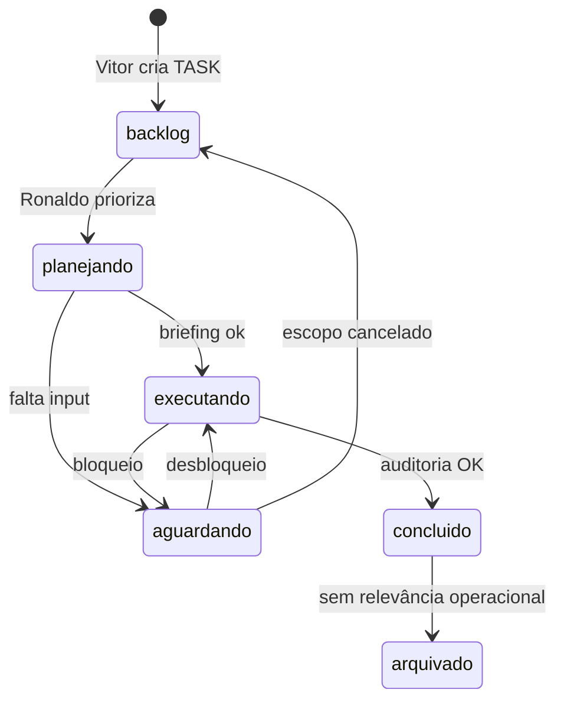

# Ciclo de vida das TASKs

Fluxo **oficial** de status das tasks no Laboratório. Markdown first — uma TASK vive em **um** arquivo Kanban por vez + opcionalmente um arquivo persistente `tasks/TASK-XXX.md`.

**Relacionados:** [modelo-task.md](modelo-task.md) · [arquitetura-agentes.md](arquitetura-agentes.md) · [pipeline_operacional.md](../workflows/pipeline_operacional.md)

---

## 1. Princípios

1. **TASK persistente** — trabalho real vira `TASK-XXX` (arquivo dedicado + entrada no Kanban).
2. **Um status por vez** — nunca duplicar a mesma TASK em dois arquivos de estado.
3. **Ronaldo Maestro** é dono do **fluxo de status** (priorizar, mover, auditar, registrar memória).
4. **Especialistas** executam dentro da TASK ativa; **não mudam status** sozinhos; **não iniciam** TASK sem briefing Ronaldo.
5. **Mover = cortar/colar** o bloco entre arquivos + atualizar `status` e `Atualizada em` no `TASK-XXX.md`.

---

## 2. Status oficiais

| Status | Significado | Arquivo Kanban | Quem move para cá |
|--------|-------------|----------------|-------------------|
| **backlog** | Identificada, ainda não planejada | `tasks/backlog.md` | Vitor (cria) / Ronaldo (reprioriza) |
| **planejando** | Ronaldo define agentes, briefing e ordem | `tasks/planejando.md` | Ronaldo |
| **executando** | Em execução ativa (WIP) | `tasks/executando.md` | Ronaldo |
| **aguardando** | Bloqueada (dependência, Vitor, externo) | `tasks/aguardando.md` | Ronaldo |
| **concluído** | Critérios de aceite atendidos | `tasks/concluidas.md` | Ronaldo (após auditoria) |
| **arquivado** | Encerrada, só consulta histórica | `tasks/arquivado.md` | Ronaldo (revisão periódica) |

### Diagrama de transições



### Transições em texto

```
backlog → planejando → executando → concluído → arquivado
              ↓           ↓
          aguardando ←────┘
              ↓
       executando | backlog
```

---

## 3. O que acontece em cada status

### backlog

- TASK existe no índice ou só como bloco no backlog.
- **Ronaldo:** ordena por impacto, velocidade, monetização, dependências, simplicidade.
- **Saída:** TASK escolhida vai para `planejando`.

### planejando

- Ronaldo lê: `contexto_global`, memória estratégica, `TASK-XXX.md`, memórias de domínio.
- Ronaldo define: agente responsável, auxiliares, entregáveis, critérios de aceite.
- Ronaldo gera **briefing curto** por agente (ver seção 5).
- **Saída:** `executando` ou `aguardando` se bloqueada.

### executando

- Especialistas trabalham **somente** no escopo da TASK (evitar resposta genérica).
- WIP máximo: **3** TASKs em `executando.md`.
- Registros por agente atualizados em `TASK-XXX.md`.
- **Saída:** entrega para auditoria → `concluído` ou bloqueio → `aguardando`.

### aguardando

- Obrigatório registrar: **motivo**, **quem desbloqueia**, **desde quando**.
- Exemplos: decisão do Vitor, gateway pagamento, dependência TASK-YYY.
- **Saída:** `executando` ou `backlog` se escopo mudou.

### concluído

- Ronaldo **auditou** entregas vs critérios de aceite.
- Registros em memória compartilhada feitos (se aplicável).
- Entrada em `concluidas.md` + status atualizado no `TASK-XXX.md`.
- **Saída:** permanece até revisão → `arquivado`.

### arquivado

- TASK sem ação operacional corrente.
- Arquivo `TASK-XXX.md` permanece como histórico.
- Revisão sugerida: mensal ou ao fechar PROJ-XXX.

---

## 4. Responsabilidades do Ronaldo Maestro

Ronaldo Maestro é **responsável oficial** pelo ciclo de vida das TASKs:

| Responsabilidade | Ação |
|------------------|------|
| **Priorizar tasks** | Ordenar `backlog.md`; alinhar com `contexto_global.md` |
| **Mover entre status** | Cortar/colar entre arquivos Kanban; atualizar `TASK-XXX.md` |
| **Briefing curto** | 2–4 linhas por agente antes de `executando` |
| **Auditar entregas** | Comparar entrega vs critérios de aceite |
| **Registrar decisões** | `memoria/decisoes.md` |
| **Registrar aprendizados** | `memoria/aprendizados.md` + `memoria/ronaldo_maestro/evolucao_orquestracao.md` |
| **Registrar hipóteses** | `memoria/hipoteses_testadas.md` (status H-XXX) |
| **Consolidar** | CONSOLIDAÇÃO FINAL + PRIORIZAÇÃO EXECUTIVA quando multiagente |
| **Log operacional** | `logs/eventos.md`, `historico_de_orquestracao.md` |

### Checklist — mudança de status (Ronaldo)

- [ ] Status e data em `TASK-XXX.md` atualizados
- [ ] Bloco movido para **único** arquivo Kanban correto
- [ ] Motivo registrado se `aguardando`
- [ ] Briefings emitidos se → `executando`
- [ ] Auditoria feita se → `concluído`
- [ ] Memória compartilhada atualizada se houve decisão/aprendizado/hipótese

### Checklist — auditoria (antes de `concluído`)

- [ ] Todos os entregáveis marcados ou justificados
- [ ] Critérios de aceite atendidos
- [ ] Seção **Auditoria do Ronaldo** preenchida em `TASK-XXX.md`
- [ ] Entrada em `decisoes.md` / `aprendizados.md` / `hipoteses_testadas.md` se relevante
- [ ] Evento em `logs/eventos.md`

---

## 5. Briefing curto (Ronaldo → agente)

Template obrigatório ao mover para `executando`:

```markdown
## Briefing — [Agente] — TASK-XXX
- **Objetivo desta rodada:** (1 frase)
- **Entregável esperado:** (E1, E2…)
- **Restrições:** (2–3 bullets)
- **Critério de pronto:** (mensurável)
- **Não fazer:** (1–2 bullets)
- **Memória de consulta:** (link memoria_* ou trecho)
```

Regra: **não** colar memória longa inteira — só o necessário para executar.

---

## 6. Estrutura de arquivos

```
tasks/
├── TASK-XXX.md          # fonte persistente (modelo: docs/modelo-task.md)
├── backlog.md           # status: backlog
├── planejando.md        # status: planejando
├── executando.md        # status: executando
├── aguardando.md        # status: aguardando
├── concluidas.md        # status: concluído (índice resumido)
└── arquivado.md         # status: arquivado (índice resumido)
```

- **TASK-XXX.md** = documento completo (objetivo, entregáveis, registros, auditoria).
- **Kanban *.md** = índice operacional com bloco resumido + link para `TASK-XXX.md`.

---

## 7. Priorização (Ronaldo)

Ao ordenar o backlog, considerar:

| Critério | Pergunta |
|----------|----------|
| **Impacto** | Move negócio ou validação do ecossistema? |
| **Velocidade** | Dá para entregar em dias, não semanas? |
| **Monetização** | Caminho claro para receita? |
| **Dependências** | Está bloqueada ou destrava outras TASKs? |
| **Simplicidade** | É a versão mínima que funciona? |

---

## 8. Exemplo ativo

**TASK-001** — Landing low ticket pintores  
- Status atual: `executando`  
- Arquivo: [tasks/TASK-001.md](../tasks/TASK-001.md)  
- Kanban: [executando.md](../tasks/executando.md)

---

## 9. Relação com pipeline operacional

| Pipeline (macro) | Ciclo de vida TASK (micro) |
|------------------|----------------------------|
| Entrada de objetivo | `backlog` |
| Consulta memória + contexto | `planejando` |
| Delegação + briefing | `planejando` → `executando` |
| Execução especialistas | `executando` |
| Consolidação + auditoria | antes de `concluído` |
| Registro memória | ao concluir ou após ciclo |
| Acompanhamento | `concluído` → próxima TASK ou `arquivado` |

---

**Última revisão:** 2026-05-31 (protocolo delegação + conferência)
