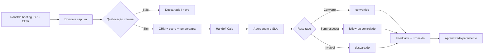

# Workflow — Captação comercial (Donizete → Caio)

Fluxo operacional oficial do handoff entre **Donizete Social** (captação) e **Caio Manteiga** (abordagem comercial).

**Relacionados:** [donizete_social.md](../agentes/donizete_social.md) · [caio_manteiga.md](../agentes/caio_manteiga.md) · [crm/leads.md](../crm/leads.md) · [arquitetura-agentes.md](arquitetura-agentes.md)

**Orquestração:** Ronaldo Maestro audita o fluxo, consolida feedback e registra aprendizado.

---

## 1. Princípios

| Princípio | Regra |
|-----------|-------|
| Baixo volume | Máx. **1 lead qualificado/hora** (fase inicial) |
| Alta qualidade | Lead inválido não passa para Caio |
| Abordagem humana | Caio personaliza; sem script robótico em massa |
| Aprendizado contínuo | Feedback Caio → Ronaldo → Donizete |
| Simplicidade | CRM markdown-first; sem ferramenta extra na v0 |
| Segurança operacional | Anti-spam; só dados públicos |

---

## 2. Visão geral do fluxo



---

## 3. Captura do lead (Donizete)

### 3.1 Onde captar

- Grupos de Facebook (monitoramento passivo + posts relevantes)
- Perfis Instagram / Facebook públicos alinhados ao ICP da TASK

### 3.2 Como captar

1. Identificar sinal de oportunidade (post, comentário, bio, pedido de indicação).
2. Coletar **apenas informações públicas** (ver seção 4).
3. Registrar imediatamente em `crm/leads.md` com status `novo`.
4. **Não abordar comercialmente** — Donizete só observa e documenta.

### 3.3 Campos obrigatórios na captura

| Campo | Obrigatório |
|-------|-------------|
| ID (`LEAD-XXX`) | ✅ |
| Nome ou @perfil | ✅ |
| Origem (grupo, post, data) | ✅ |
| Perfil social | ✅ |
| TASK vinculada | ✅ |
| Data de captura | ✅ |
| Observações (contexto) | ✅ |

---

## 4. Qualificação mínima

Donizete qualifica **antes** de marcar `qualificado`. Checklist:

| # | Critério | Sim / Não |
|---|----------|-----------|
| 1 | Encaixa no **ICP** do briefing (TASK ativa) | |
| 2 | Atua no **serviço/região** alvo | |
| 3 | Existe **contato público** ou canal DM aberto | |
| 4 | Há **contexto útil** para abordagem (dor, post, bio) | |
| 5 | Lead **não** é concorrente, spam ou perfil fake | |
| 6 | Captação respeitou **limites anti-spam** | |

**Mínimo para passar:** itens 1–4 = Sim. Itens 5–6 = Sim obrigatório.

Se falhar → status `descartado` com motivo em Observações.

---

## 5. Critérios de lead válido

Lead **válido para handoff Caio** quando:

1. Status = `qualificado`
2. Score ≥ **3** (ver seção 8)
3. Temperatura definida (frio | morno | quente)
4. Origem + contexto documentados (Caio consegue abordar sem perguntar "quem é?")
5. TASK referenciada
6. Dentro do limite horário (1 qualificado/hora)

Lead **inválido** (não handoff):

- Sem contato e sem perfil aberto para DM
- Fora do ICP
- Sem contexto de abordagem
- Captado com violação anti-spam
- Duplicata (mesmo contato/perfil já no CRM)

---

## 6. Registro no CRM

**Arquivo:** `crm/leads.md`

### Template completo (handoff)

```markdown
## LEAD-XXX — [Nome ou @perfil]

| Campo | Valor |
|-------|-------|
| **ID** | LEAD-XXX |
| **Nome** | |
| **Cidade** | |
| **Serviço** | |
| **Contato** | telefone / WA / DM |
| **Origem** | Grupo/post/perfil — link ou descrição |
| **Perfil social** | @ ou URL |
| **Status** | qualificado |
| **Responsável** | donizete_social → caio_manteiga |
| **TASK** | TASK-XXX |
| **Score** | 0–5 |
| **Temperatura** | frio \| morno \| quente |
| **Prioridade** | P1 \| P2 \| P3 |
| **Tags** | ver seção 10 |
| **Observações** | contexto + gancho sugerido |
| **Data captura** | YYYY-MM-DD |
| **Handoff Caio** | YYYY-MM-DD HH:MM |
| **SLA abordagem** | até HH:MM (captura + 4h úteis) |
```

### ID sequencial

- Formato: `LEAD-001`, `LEAD-002`, …
- Atualizar índice no topo de `crm/leads.md`

---

## 7. Passagem para Caio (handoff)

### 7.1 Gatilho

Donizete altera:

- `Status`: `novo` → `qualificado` → `entregue_caio`
- `Responsável`: `caio_manteiga`
- Preenche Score, Temperatura, Prioridade, Tags, Handoff Caio, SLA

### 7.2 Notificação

Na v0 (markdown-first):

1. Entrada completa no CRM
2. Linha no índice de leads
3. Registro em `logs/eventos.md`:

```markdown
### YYYY-MM-DD — [handoff] LEAD-XXX → Caio
- **Agente(s):** donizete_social, caio_manteiga
- **Detalhe:** [Nome] · score X · temp morno · TASK-XXX
- **Ref:** crm/leads.md
```

### 7.3 O que Caio recebe

| Entrega | Conteúdo |
|---------|----------|
| Quem | Nome, serviço, cidade |
| Onde veio | Origem detalhada |
| Por que agora | Observações + gancho |
| Como abordar | Temperatura + tags |
| Urgência | Prioridade + SLA |

Caio **não** recaptura informação que Donizete deveria ter documentado.

---

## 8. Lead score simples (0–5)

Pontuação objetiva — soma dos critérios abaixo:

| Critério | Pontos |
|----------|--------|
| Encaixa ICP perfeito | +1 |
| Contato direto público (WA/tel) | +1 |
| Sinal de dor/intenção recente (post ≤ 7 dias) | +1 |
| Região alvo confirmada | +1 |
| Contexto rico para abordagem personalizada | +1 |

| Score | Interpretação | Handoff |
|-------|---------------|---------|
| 0–2 | Fraco | Não handoff — manter `novo` ou `descartado` |
| 3 | Aceitável | Handoff Caio (P2/P3) |
| 4–5 | Forte | Handoff Caio prioritário (P1) |

---

## 9. Temperatura do lead

| Temperatura | Sinais | Abordagem Caio |
|-------------|--------|----------------|
| **Quente** | Pediu indicação, reclamou de falta de clientes, perguntou preço | Abordar no SLA mínimo; tom direto e útil |
| **Morno** | Perfil compatível, atividade recente, sem pedido explícito | Abordagem consultiva; gancho no contexto captado |
| **Frio** | Só encaixa ICP; pouco contexto | Só handoff se score ≥ 4; abordagem leve, sem pressão |

Donizete define temperatura na qualificação. Caio pode ajustar após primeiro contato (registrar no CRM).

---

## 10. Tags operacionais

Tags livres, separadas por vírgula no CRM. Sugestões:

| Tag | Uso |
|-----|-----|
| `#pintor` `#autonomo` | ICP / segmento |
| `#sem-site` `#so-indicacao` | Dor detectada |
| `#grupo-fb` `#instagram` | Canal origem |
| `#regiao-sp` | Geo |
| `#contato-wa` `#so-dm` | Tipo contato |
| `#urgente` | Prioridade operacional (com critério) |
| `#duplicata-evitada` | Controle qualidade Donizete |

Máximo recomendado: **5 tags/lead** — evitar ruído.

---

## 11. Prioridade do lead

| Prioridade | Quando usar | Ordem fila Caio |
|------------|-------------|-----------------|
| **P1** | Score 4–5 ou temperatura quente | 1º |
| **P2** | Score 3, morno, ICP claro | 2º |
| **P3** | Score 3, frio, contexto limitado | 3º |

Caio aborda **P1 antes de P2 antes de P3**, respeitando SLA individual.

---

## 12. Tempo máximo de abordagem (SLA)

| Evento | SLA |
|--------|-----|
| Handoff Donizete → Caio | Registro imediato no CRM |
| **Primeira abordagem Caio** | **≤ 4 horas úteis** após handoff |
| Lead P1 quente | **≤ 2 horas úteis** (meta) |
| Follow-up 1 (sem resposta) | D+1 |
| Follow-up 2 | D+3 |
| Encerramento sem resposta | D+7 → `sem_resposta` |

Horário útil padrão: 08h–20h (ajustar por briefing TASK).

Se SLA estourar → Caio registra motivo; Juarez/Ronaldo podem auditar gargalo.

---

## 13. Status comerciais

Fluxo oficial no CRM:

```
novo → qualificado → entregue_caio → abordado → convertido
                                      ↓
                              sem_resposta → descartado
                                      ↓
                                 descartado (qualquer etapa)
```

| Status | Dono | Significado |
|--------|------|-------------|
| `novo` | Donizete | Capturado, não qualificado |
| `qualificado` | Donizete | Passou checklist; pronto handoff |
| `entregue_caio` | Donizete → Caio | Handoff formalizado |
| `abordado` | Caio | Primeira mensagem enviada |
| `convertido` | Caio | Resposta positiva / oportunidade / venda |
| `sem_resposta` | Caio | Follow-ups esgotados |
| `descartado` | Donizete ou Caio | Fora de ICP ou inviável — **motivo obrigatório** |

---

## 14. Regras de follow-up (Caio)

1. **Máximo 3 toques** por lead sem resposta (D0 abordagem, D+1, D+3).
2. Mensagens **diferentes** — nunca copy idêntica.
3. Tom humano, curto, benefício real — ver `memoria_comercial_caio.md`.
4. Sem urgência falsa; sem spam.
5. Após D+7 sem resposta → `sem_resposta` + motivo.
6. Se lead pedir para parar → `descartado` (`#opt-out`).

Caio registra data de cada toque em Observações ou subseção do lead.

---

## 15. Critérios de descarte

| Quem | Motivo | Exemplo tag |
|------|--------|-------------|
| Donizete | Fora ICP | `#fora-icp` |
| Donizete | Sem contato viável | `#sem-contato` |
| Donizete | Duplicata | `#duplicata` |
| Donizete | Perfil fake/spam | `#spam` |
| Caio | Já tem solução / não interessado | `#nao-interesse` |
| Caio | Concorrente | `#concorrente` |
| Caio | Opt-out | `#opt-out` |
| Caio | Contato inválido | `#contato-invalido` |

Todo descarte exige **1 linha de motivo** no CRM.

---

## 16. Regras anti-spam

### Donizete (captação)

| Proibido | Permitido |
|----------|-----------|
| Flood em grupos | Ler e observar |
| Comentários idênticos | — |
| DM em massa | — |
| Follow/unfollow automático | — |
| > 1 lead qualificado/hora | 1 lead qualificado/hora |
| Pressão em thread alheia | Registrar lead passivamente |

### Caio (abordagem)

| Proibido | Permitido |
|----------|-----------|
| Blast WhatsApp | 1:1 personalizado |
| Copy genérica em massa | Script adaptado ao contexto Donizete |
| > 3 follow-ups | Sequência D+1, D+3, encerrar D+7 |
| Abordar lead `descartado` | — |

Violação → Ronaldo pausa captação/abordagem na TASK e registra em `memoria/decisoes.md`.

---

## 17. Limites operacionais

| Limite | Valor | Revisão |
|--------|-------|---------|
| Leads qualificados | 1/hora | Ronaldo após 30 dias |
| Leads entregues Caio | ≤ 8/dia útil (fase inicial) | Ronaldo |
| Abordagens Caio | ≤ 10/dia útil (fase inicial) | Ronaldo |
| Follow-ups por lead | 3 máx. | Fixo |
| Tags por lead | 5 recomendado | — |
| Dados coletados | Só públicos | Fixo |

---

## 18. Feedback do Caio para Ronaldo

Caio envia **resumo semanal** ou ao fechar lote de leads:

### Formato feedback

```markdown
## Feedback comercial — [semana ou TASK-XXX]

- **Leads recebidos:** N
- **Abordados no SLA:** N (%)
- **Convertidos:** N (%)
- **Sem resposta:** N
- **Descartados pós-abordagem:** N (+ motivos)
- **Origem que mais converteu:** ...
- **Origem fraca:** ...
- **Qualidade contexto Donizete:** alta | média | baixa
- **Ajuste ICP sugerido:** ...
- **Ajuste copy/script:** ...
```

Ronaldo consolida e decide:

- Briefing novo para Donizete (ICP, grupos, tags)
- Ajuste para Caio (script, SLA)
- Entrada em `memoria/aprendizados.md` e `memoria/hipoteses_testadas.md`

---

## 19. Aprendizado comercial persistente

| O quê | Onde registrar |
|-------|----------------|
| Origem que converte | `memoria/memoria_comercial_caio.md` + feedback Caio |
| Sinais de lead quente | `memoria/aprendizados.md` (tag `#captacao`) |
| ICP refinado | Briefing TASK + `memoria/decisoes.md` se global |
| Hipótese de canal | `memoria/hipoteses_testadas.md` (H-XXX) |
| Motivos de descarte recorrentes | Seção em `crm/leads.md` ou aprendizados |

### Ciclo de aprendizado

```
Captação → Abordagem → Resultado → Feedback Caio
    → Ronaldo audita → Atualiza memória → Novo briefing Donizete
```

Frequência mínima: **1 revisão por TASK ativa** ou a cada 10 leads processados.

---

## 20. Papéis resumidos

| Agente | Responsabilidade no workflow |
|--------|------------------------------|
| **Ronaldo Maestro** | Briefing ICP, limites, auditoria, aprendizado persistente |
| **Donizete Social** | Captura, qualificação, CRM, handoff, anti-spam captación |
| **Caio Manteiga** | Priorização fila, abordagem, follow-up, feedback, status CRM |
| **Juarez** | SLA entrega pós-venda (após `convertido`) — fora deste handoff |
| **Vitor** | ICP final, exceções de limite, validação estratégica |

---

## 21. Exemplo TASK-001 (pintores autônomos)

| Campo | Valor exemplo |
|-------|---------------|
| ICP | Pintor autônomo, PF, região metropolitana |
| Origens | Grupos FB pintores, Instagram #pintor + cidade |
| Oferta | Página R$ 49 — TASK-001 |
| Tags | `#pintor` `#autonomo` `#sem-site` |
| Sinal quente | "Preciso de mais clientes", "só trabalho com indicação" |

---

## 22. Checklist rápido — Donizete (handoff)

- [ ] Lead no CRM com ID único
- [ ] Qualificação mínima (6 itens)
- [ ] Score ≥ 3
- [ ] Temperatura + prioridade + tags
- [ ] Origem + contexto + TASK
- [ ] Status `entregue_caio`
- [ ] Evento em `logs/eventos.md`
- [ ] Limite 1/hora respeitado

## 23. Checklist rápido — Caio (abordagem)

- [ ] Leu contexto Donizete no CRM
- [ ] Abordou dentro do SLA
- [ ] Mensagem personalizada (não robô)
- [ ] Status → `abordado`
- [ ] Follow-ups agendados se necessário
- [ ] Resultado atualizado no CRM
- [ ] Feedback periódico ao Ronaldo

---

**Versão:** 1.0  
**Criado em:** 2026-05-28  
**Dono do workflow:** Ronaldo Maestro
