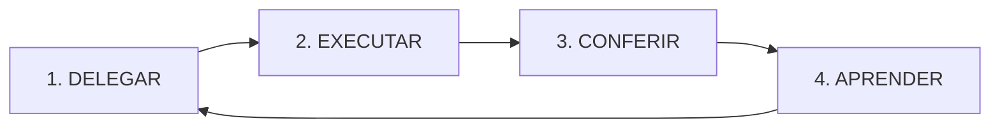

# Protocolo — Delegação, Conferência e Evolução

**Dono:** Ronaldo Maestro · **Obrigatório para toda TASK** · **Fábrica:** repo Laboratório only

Nenhum agente especialista executa trabalho de TASK **sem** passar por este ciclo. Autonomia do Ronaldo (2026-05-31) significa que **ele** inicia e delega — não que Dev/Loide/Juarez/Caio iniciem sozinhos.

---

## Ciclo obrigatório (4 fases)



| Fase | Quem | Gate | Onde registrar |
|------|------|------|----------------|
| **1. Delegar** | Ronaldo | Briefing por agente antes de `executando` | `TASK-XXX.md` § Briefings + `planejando→executando` |
| **2. Executar** | Especialista | Só escopo do briefing | `TASK-XXX.md` § Registros por agente |
| **3. Conferir** | Ronaldo | Auditoria vs critérios de aceite | `TASK-XXX.md` § Auditoria do Ronaldo |
| **4. Aprender** | Ronaldo | Aprendizado acionável | `memoria/aprendizados.md` + `evolucao_orquestracao.md` |

**Regra de ouro:** `executando` **só** com briefing Ronaldo · `concluído` **só** com auditoria Ronaldo preenchida.

---

## Fase 1 — Delegar

Antes de mover TASK para `executando.md`:

1. Ler `contexto/contexto_global.md` + memória relevante
2. Definir: responsável, auxiliares, entregáveis, critérios de aceite
3. Emitir **briefing curto** por agente (template em [ciclo-de-vida-tasks.md](../../docs/ciclo-de-vida-tasks.md))
4. Referenciar skills quando aplicável (`memoria/agentes/skills-biblioteca.md`)
5. Registrar evento em `logs/eventos.md` — tipo `[delegacao]`
6. Mover kanban: `planejando → executando` (ou `backlog → planejando → executando`)

### Checklist delegação

- [ ] Briefing Dev / Loide / Juarez / Caio / Donizete (quem for acionado)
- [ ] PROJ-002: reforçar separação Lab vs `centralvitor`
- [ ] WIP ≤ 3 em `executando.md`
- [ ] Entrada em `historico_de_orquestracao.md` se ciclo novo

---

## Fase 2 — Executar

**Especialistas:**

- Executam **somente** o briefing da TASK ativa
- **Não** mudam status do kanban
- **Não** iniciam TASK nova sem Ronaldo
- Atualizam § Registros por agente em `TASK-XXX.md` ao entregar rodada

**Ronaldo durante execução:**

- Acompanha WIP e bloqueios
- Move para `aguardando` se necessário
- **Não** microgerencia implementação

---

## Fase 3 — Conferir (auditoria)

Antes de mover TASK para `concluidas.md`:

1. Comparar entregáveis (E1, E2…) vs realidade
2. Verificar critérios de aceite (checkboxes)
3. Preencher § **Auditoria do Ronaldo** em `TASK-XXX.md`
4. Veredito: `aprovado` | `retrabalho` | `cancelado`
5. Se `retrabalho` → volta `executando` com briefing de correção
6. Se `aprovado` → mover kanban + evento `[auditoria]` em `logs/eventos.md`

### Checklist conferência

- [ ] Todos entregáveis marcados ou justificados
- [ ] Critérios de aceite OK (ou exceção documentada)
- [ ] Veredito explícito
- [ ] Aceite Vitor registrado quando for critério (ex.: login, CRUD)

---

## Fase 4 — Aprender (evolução constante)

**Obrigatório** ao aprovar TASK (mínimo 1 aprendizado se houve execução real):

1. Entrada em `memoria/aprendizados.md` (tags `#orquestracao` `#dev` `#ux` …)
2. Entrada em `memoria/ronaldo_maestro/evolucao_orquestracao.md` — o que Ronaldo **muda** nos próximos briefings
3. Se decisão estrutural → `memoria/decisoes.md` ou `decisoes_criticas.md`
4. Próximo briefing da mesma trilha **deve citar** aprendizado relevante

### Template aprendizado (Ronaldo)

```markdown
### YYYY-MM-DD — [Título] #orquestracao
- **TASK:** TASK-XXX
- **Situação:**
- **Aprendizado:**
- **Muda no próximo briefing:**
- **Tags:**
```

### Template evolução Ronaldo

```markdown
### YYYY-MM-DD — pós TASK-XXX
- **Padrão que funcionou:**
- **Erro a não repetir:**
- **Ajuste permanente no protocolo/briefing:**
```

---

## Exceções

| Situação | Quem age | Depois |
|----------|----------|--------|
| Vitor pede fix urgente em sessão Cursor | Dev executa | Ronaldo registra delegação + auditoria **retroativa** em 24h |
| TASK já em `executando` sem briefing (dívida) | Ronaldo | Backfill briefing + auditoria antes de próxima TASK |
| Bloqueio externo | Ronaldo → `aguardando` | Aprendizado só se houver lição de processo |

---

## Integração

- Pipeline: [workflows/pipeline_operacional.md](../../workflows/pipeline_operacional.md)
- Ciclo TASK: [docs/ciclo-de-vida-tasks.md](../../docs/ciclo-de-vida-tasks.md)
- Modelo TASK: [docs/modelo-task.md](../../docs/modelo-task.md)
- Agente: [agentes/ronaldo_maestro.md](../../agentes/ronaldo_maestro.md)

**Última revisão:** 2026-05-31 (mandato Vitor — delegação + conferência + evolução)
