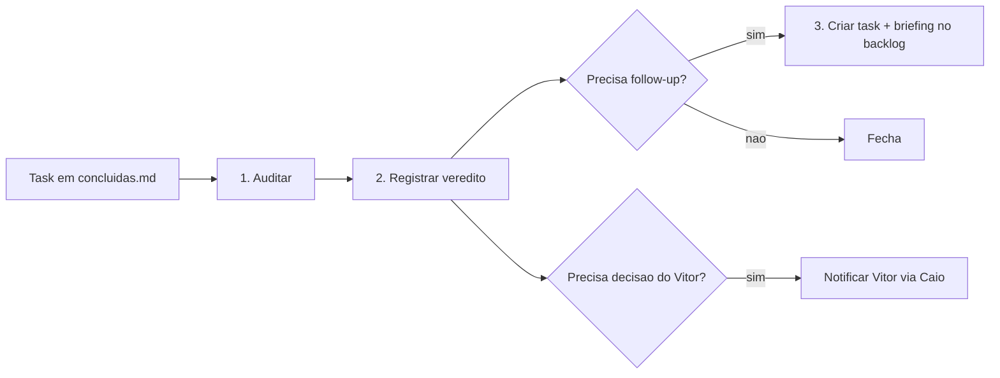

# Rotina — Auditoria Pós-Conclusão (Ronaldo Maestro)

**Dono:** Ronaldo Maestro · **Dispara:** toda task que entra em `tasks/concluidas.md` · **Automação:** `ronaldo-audit.timer` (10 min)

Quando uma task é concluída, o ciclo não termina: o Ronaldo **audita**, registra o veredito e — se houver gap ou próximo passo — **delega e cria mais task**. Esta rotina é o passo "CONFERIR + APRENDER" do [protocolo de delegação](protocolo_delegacao_conferencia.md), agora com gatilho automático.

---

## Gatilho

- **Automático:** `systemd` roda `python -m laboratorio ronaldo-audit` a cada **10 min** (alinhado à cadência de tasks).
- **Manual:** `python -m laboratorio ronaldo-audit [--dry-run] [--no-create] [--no-notify]`.
- **Idempotente:** cada task é auditada **uma única vez** (estado em `logs/ronaldo_audit_state.json`). Tasks anteriores ao deploy ficam marcadas como já auditadas.

---

## O que o Ronaldo faz por task concluída

### 1. Auditar
Compara o **resultado declarado** vs **objetivo** da task e produz:
- **Veredito:** `aprovado` · `aprovado_com_ressalvas` · `ajustes_necessarios`
- **Resumo:** 1–2 frases
- **Gaps:** pontos faltantes / riscos
- **Aprendizados:** lições para o ecossistema
- **Follow-ups:** no máximo **2**, cada um com `título · agente · objetivo · prioridade`

Sem `OPENAI_API_KEY`, cai em **fallback heurístico**: registra auditoria mínima e escala ao Vitor se a task fechou sem resultado declarado (não inventa follow-ups).

### 2. Registrar
Grava bloco em [`logs/auditorias.md`](../../logs/auditorias.md) (mais recente no topo): veredito, resumo, gaps, aprendizados, follow-ups criados, escalonamento.

### 3. Delegar / criar mais task (só se necessário)
Para cada follow-up:
- Resolve o **projeto** da task-mãe (via `projetos/projetos.md`) e gera o próximo ID com o **prefixo do projeto** (ex.: `LP-PINTOR-006`, `LAB-007`).
- Cria `tasks/<ID>.md` em **`backlog`** com `### Briefing` para o agente (a delegação já nasce escrita).
- Adiciona a entrada em `tasks/backlog.md` com a origem `follow-up auditoria <ID-mãe>`.
- **Não** promove sozinho para `executando` — a promoção respeita a **cadência de 10 min** e segue o fluxo normal de delegação.

### 4. Escalar ao Vitor (exceção)
Só quando precisa de decisão/autorização dele: dispara WhatsApp via Caio ([notify](../../backend/src/laboratorio/whatsapp/notify.py)) com ref para `logs/auditorias.md`. Caso contrário, opera em autonomia total.

---

## Limites e segurança

- **Máx. 2 follow-ups** por task auditada (evita explosão de backlog).
- Follow-ups entram em **backlog**, nunca direto em execução.
- Auditoria é **idempotente** — não reprocessa histórico.
- Cadência preservada: criar task no backlog não inicia trabalho; só a promoção a `executando` conta para o intervalo de 10 min.

---

## Configuração

| Variável | Default | Efeito |
|----------|---------|--------|
| `AUDIT_LLM_MODEL` | `VITOR_WHATSAPP_MODEL` → `gpt-4o-mini` | Modelo da auditoria |
| `OPENAI_API_KEY` | — | Sem ela → fallback heurístico |
| `TASK_CADENCE_MIN` | 10 | Intervalo entre promoções a `executando` |

- **Governança contínua:** `./run.sh governanca-audit --log` · integrado na patrulha · `logs/governanca_auditoria.md`

**Arquivos:** `backend/src/laboratorio/ops/ronaldo_audit.py` · `governance_audit.py` · `deploy/vps/ronaldo-audit.{service,timer}` · estado `logs/ronaldo_audit_state.json`

**Última revisão:** 2026-06-02 (governança kanban + backfill auditorias)
