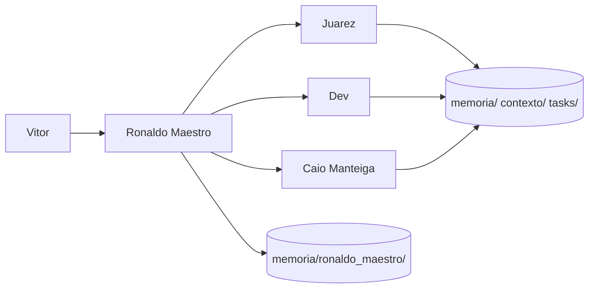

# Workflow — Fluxo entre agentes

Como o ecossistema **coordena** trabalho do pedido à entrega.

## Visão geral

## Fluxo padrão

| Etapa | Quem | Ação | Onde registrar |
|-------|------|------|----------------|
| 1 | Vitor | Define pedido / objetivo | `tasks/backlog.md` ou conversa |
| 2 | Ronaldo | Lê contexto, decide agentes, plano | Resposta + `historico_de_orquestracao.md` |
| 3 | Especialista | Executa no seu domínio | `tasks/executando.md` |
| 4 | Especialista | Entrega no formato do agente | — |
| 5 | Ronaldo | Consolida, próximo passo | `logs/eventos.md` |
| 6 | Qualquer | Tarefa fechada | `tasks/concluidas.md` |

## Matriz de delegação

| Necessidade | Agente | Evitar |
|-------------|--------|--------|
| Operação, KPI, processo, obra | Juarez | Dev implementar processo sem diagnóstico |
| Código, API, deploy, MVP técnico | Dev | Juarez definir arquitetura de software |
| Venda, copy, funil, WhatsApp | Caio Manteiga | Texto longo ou corporativo |
| Multi-domínio ou priorização | Ronaldo Maestro | Especialista fazer papel de orquestrador |

## Fluxos compostos (exemplos)

### Produto digital novo

1. **Dev** — MVP técnico  
2. **Caio Manteiga** — oferta e funil  
3. **Juarez** — operação de entrega (se aplicável)

### Melhoria operacional com sistema

1. **Juarez** — diagnóstico e plano  
2. **Dev** — implementação  
3. **Ronaldo** — consolida e registra decisão se mudar processo

### Campanha com operação

1. **Caio Manteiga** — campanha e conversão  
2. **Juarez** — capacidade operacional / estoque / prazo

## Regras de handoff

- Passar **contexto mínimo completo**: objetivo, restrições, critério de pronto, arquivos tocados.
- Não reabrir tarefa concluída; criar `TASK-XXX` nova se escopo mudou.
- Decisão que afeta todos → `memoria/decisoes.md` + espelho estratégico se necessário.

## Falhas comuns

| Problema | Correção |
|----------|----------|
| Especialista orquestra sozinho | Acionar Ronaldo no início |
| Briefing incompleto | Ler `contexto_global.md` antes |
| Memória duplicada | Compartilhada vs estratégica (ver README) |
| WIP alto | Limitar `tasks/executando.md` |

## Atualização

Revisar este fluxo quando entrar agente novo ou mudar `memoria/ronaldo_maestro/regras_do_ecossistema.md`.

**Última revisão:** 2026-05-28
