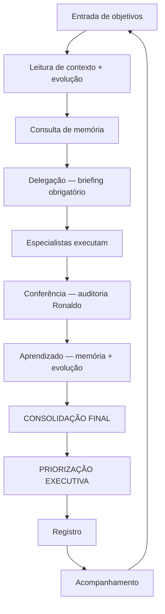

# Pipeline operacional — Ronaldo Maestro

Fluxo contínuo do ecossistema multiagente: do objetivo do Vitor até registro, acompanhamento e aprendizado.

**Orquestrador:** Ronaldo Maestro (`agentes/ronaldo_maestro.md`)  
**Execução programática:** `backend/orquestrador.py` → `./run.sh orquestrar`  
**Complementos:** [fluxo_agentes.md](fluxo_agentes.md) · [onboarding.md](onboarding.md)

---

## 1. Fluxo operacional do sistema



| Etapa | Responsável | Ação | Onde |
|-------|-------------|------|------|
| **Entrada de objetivos** | Vitor | Define pedido, meta ou problema | Conversa, `tasks/backlog.md`, `./run.sh orquestrar "..."` |
| **Leitura de contexto** | Ronaldo | Lê foco e restrições atuais | `contexto/contexto_global.md` |
| **Consulta de memória** | Ronaldo | Decisões, projetos, aprendizados, **evolução orquestração** | `memoria/*.md`, `memoria/ronaldo_maestro/evolucao_orquestracao.md` |
| **Delegação** | Ronaldo | Briefing por agente — **gate para `executando`** | `TASK-XXX.md` § Briefings, `tasks/planejando.md` |
| **Execução** | Especialistas | Somente escopo do briefing | `TASK-XXX.md` § Registros |
| **Conferência** | Ronaldo | Auditoria vs critérios — **gate para `concluído`** | `TASK-XXX.md` § Auditoria do Ronaldo |
| **Aprendizado** | Ronaldo | Incorporar lições nos próximos briefings | `aprendizados.md`, `evolucao_orquestracao.md` |
| **CONSOLIDAÇÃO FINAL** | Ronaldo | Multiagente — comparar, decidir | Etapa 1 do Ronaldo |
| **PRIORIZAÇÃO EXECUTIVA** | Ronaldo | Top 3, decisão de hoje, TASK, KPI | Etapa 2 do Ronaldo — saída final |
| **Registro** | Ronaldo | Histórico + evento | `historico_de_orquestracao.md`, `logs/eventos.md` |
| **Acompanhamento** | Vitor / Ronaldo | Executar próximo passo 24h | `tasks/` |

### Ciclo contínuo

1. Nada fica só na conversa — objetivo vira **TASK-XXX** no backlog quando for trabalho real.
2. Todo ciclo de orquestração gera **registro** (evento + histórico).
3. Tarefa concluída vai para **concluídas**; referência antiga vai para **arquivado** quando não for mais consultada.
4. Aprendizado e decisões alimentam a **próxima** entrada de objetivos.

---

## 2. Estados das tarefas

| Estado | Significado | Arquivo |
|--------|-------------|---------|
| **backlog** | A fazer, priorizado ou não | `tasks/backlog.md` |
| **planejando** | Ronaldo define plano, agentes e briefing | `tasks/planejando.md` |
| **executando** | Especialista em execução (WIP ativo) | `tasks/executando.md` |
| **aguardando** | Bloqueada: dependência, Vitor, dado externo | `tasks/aguardando.md` |
| **concluído** | Critério de pronto atendido | `tasks/concluidas.md` |
| **arquivado** | Encerrado sem relevância operacional atual | `tasks/arquivado.md` |

### Transições permitidas

```
backlog → planejando → executando → concluído → arquivado
                ↓           ↓
            aguardando ←────┘
                ↓
         executando | backlog (se cancelar escopo)
```

**Regra:** mover o bloco da tarefa entre arquivos (cortar/colar). Não duplicar a mesma `TASK-XXX` em dois arquivos.

**WIP máximo em `executando.md`:** 3 tarefas.

---

## 3. Regras do Ronaldo Maestro

### Quando delegar

| Situação | Delegar para |
|----------|----------------|
| Operação, processo, KPI, logística, obra | Juarez |
| Código, arquitetura, deploy, integração | Dev |
| Oferta, copy, funil, WhatsApp, conversão | Caio Manteiga |
| Pedido cruza 2+ domínios | Ronaldo orquestra; ordem típica: Juarez → Dev → Caio (ajustar ao caso) |
| Só priorização / organização | Ronaldo responde sem acionar especialista |

**Não delegar:** tarefa especializada que Ronaldo pode “chutar” sem agente — sempre passar ao dono do domínio.

### Quando registrar memória

| O quê | Onde |
|-------|------|
| Decisão do dia a dia (todos precisam saber) | `memoria/decisoes.md` |
| Aprendizado, erro, padrão aprovado | `memoria/aprendizados.md` |
| Mudança de direção do ecossistema | `memoria/ronaldo_maestro/decisoes_criticas.md` |
| Ciclo de orquestração completo | `memoria/ronaldo_maestro/historico_de_orquestracao.md` |
| Evento / marco / falha resumida | `logs/eventos.md` |
| Foco da semana alterado | `contexto/contexto_global.md` |

### Quando mover tarefas

| Momento | De → Para | Quem decide |
|---------|-----------|-------------|
| Objetivo aceito, vai planejar | backlog → planejando | Ronaldo (autonomia Vitor 2026-05-31) |
| Plano pronto, agente começou | planejando → executando | **Ronaldo — sem OK prévio do Vitor** |
| Falta input do Vitor ou dependência | executando → aguardando | Ronaldo ou agente |
| Desbloqueou | aguardando → executando | Ronaldo |
| Critério de pronto OK | executando → concluidas | **Ronaldo audita → preenche § Auditoria → aprendizado** |
| Histórico antigo, sem ação | concluidas → arquivado (opcional, mensal) | Ronaldo |

**Autonomia (2026-05-31):** Ronaldo inicia tasks quando julgar o momento — registrar em `logs/eventos.md`. WIP máx. 3: se abrir 4ª, repriorizar explicitamente (mover menor impacto para `aguardando`).

### Quando gerar relatório

- Fim de **ciclo de orquestração** (`orquestrar` ou sessão manual) → consolidação nas 6 seções + registro em histórico.
- **Semanal** (se Vitor pedir) → resumo: concluídas, bloqueios, próximas 3 prioridades do backlog.
- **Escalação de prioridade** → relatório curto: o que mudou, por quê, novo top 3.

### Quando escalar prioridade

- Objetivo do Vitor marcado como urgente.
- Bloqueio em `aguardando.md` > 48h sem dono.
- Risco de perda de receita ou operação parada (Juarez/Caio sinalizam).
- Ação: atualizar `contexto/contexto_global.md` + mover tarefa ao topo do backlog + informar Vitor.

### CONSOLIDAÇÃO FINAL (etapa 1 — após especialistas)

Ronaldo age como **diretor fechando reunião**. Os três já falaram — **não pedir mais nada**.

| Passo | Ação |
|-------|------|
| 1 | Ler Juarez, Dev e Caio lado a lado |
| 2 | Extrair **convergências** (preço, prazo, canal, MVP) |
| 3 | Listar **divergências** e **decidir** (uma escolha por conflito) |
| 4 | Montar **plano operacional único** (máx. 7 linhas, dono + prazo) |
| 5 | Remover redundância e jargão |

**Proibido:** “aguardar retornos”, “coletar entregas”, “os agentes devem…”.

### PRIORIZAÇÃO EXECUTIVA (etapa 2 — saída para o Vitor)

| Passo | Ação |
|-------|------|
| 1 | Top 3 ações por impacto (hoje / semana / depois) |
| 2 | **Decisão de hoje** — uma frase imperativa |
| 3 | **Próximo passo** — ação única em 24h |
| 4 | **TASK-XXX** sugerida para `tasks/backlog.md` |
| 5 | **KPI** simples com meta |

**Proibido:** repetir o que especialistas disseram; tabela de “futuras delegações”.

Implementação programática: `orquestrador.py` — duas tasks sequenciais do Ronaldo após Juarez, Dev e Caio.

Validar contra [critérios de qualidade](#4-critérios-de-qualidade).

---

## 4. Critérios de qualidade

Toda entrega consolidada pelo Ronaldo deve ser avaliada nestes eixos:

| Critério | Pergunta |
|----------|----------|
| **Objetividade** | Dá para executar sem reinterpretar? |
| **Aplicabilidade** | Resolve o objetivo do Vitor? |
| **Simplicidade** | É a solução mais simples que funciona? |
| **Monetização** | Há caminho claro para receita ou valor? |
| **Baixo custo operacional** | Evita ferramenta/custo desnecessário? |
| **Velocidade de execução** | Próximo passo alcançável em curto prazo? |

**Reprovação:** texto vago, “aguardar análises/entregas”, “coletar quando agentes retornarem”, arquitetura pesada sem MVP, promessa sem teste, oferta complexa, consolidação sem decisão em divergências.

---

## 5. Estrutura padrão das tasks

Toda `TASK-XXX` usa este bloco (copiar para backlog e mover entre arquivos):

```markdown
### TASK-XXX — [Título]
- **Objetivo:** (uma frase — resultado de negócio)
- **Contexto:** (links: PROJ-XXX, decisões, restrições)
- **Prioridade:** alta | media | baixa
- **Agente responsável:** ronaldo_maestro | juarez | dev | caio_manteiga
- **Status:** backlog | planejando | executando | aguardando | concluido | arquivado
- **Dependências:** TASK-YYY | aguardando Vitor | nenhuma
- **Resultado esperado:** (critério de pronto mensurável)
- **Criada em:** YYYY-MM-DD
- **Atualizada em:** YYYY-MM-DD
```

---

## 6. Fluxo de aprendizado

| Tipo | Registrar em | Quando |
|------|------------|--------|
| **Erros** | `memoria/aprendizados.md` (tag `#erro`) | Falha de processo, bug, orquestração ruim |
| **Padrões aprovados** | `memoria/aprendizados.md` (tag `#padrao`) | Fluxo que funcionou e deve repetir |
| **Melhorias** | `memoria/aprendizados.md` (tag `#melhoria`) | Otimização sem mudar direção |
| **Decisões críticas** | `memoria/ronaldo_maestro/decisoes_criticas.md` | Impacto multiagente ou estratégico |
| **Decisões operacionais** | `memoria/decisoes.md` | Impacto tático, todos os agentes |

Template rápido (aprendizado):

```markdown
### YYYY-MM-DD — [Título] #erro|#padrao|#melhoria
- **Situação:**
- **Aprendizado:**
- **Ação daqui pra frente:**
```

---

## Checklist — Ronaldo em cada ciclo

- [ ] Li `contexto/contexto_global.md` e `evolucao_orquestracao.md`
- [ ] Consultei `memoria/decisoes.md` e `projetos.md`
- [ ] Priorizei / criei `TASK-XXX`
- [ ] **Deleguei** — briefing por agente registrado (gate `executando`)
- [ ] Especialistas executaram dentro do briefing
- [ ] **Conferi** — § Auditoria preenchida (gate `concluído`)
- [ ] **Aprendizado** em `aprendizados.md` + `evolucao_orquestracao.md`
- [ ] CONSOLIDAÇÃO FINAL (se multiagente)
- [ ] PRIORIZAÇÃO EXECUTIVA
- [ ] Registrei em `historico_de_orquestracao.md` + `logs/eventos.md`
- [ ] Kanban atualizado no arquivo correto
- [ ] Próximo passo claro

---

**Última revisão:** 2026-05-31 (protocolo delegação + conferência + evolução)
